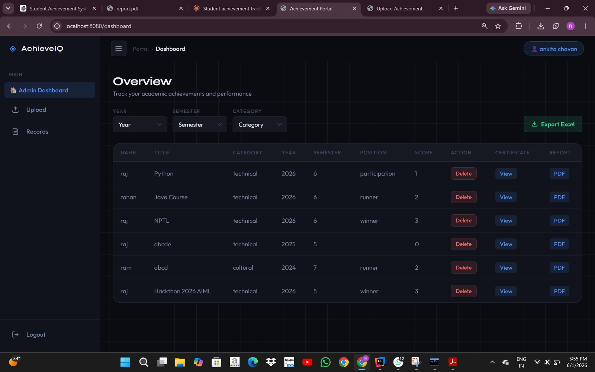
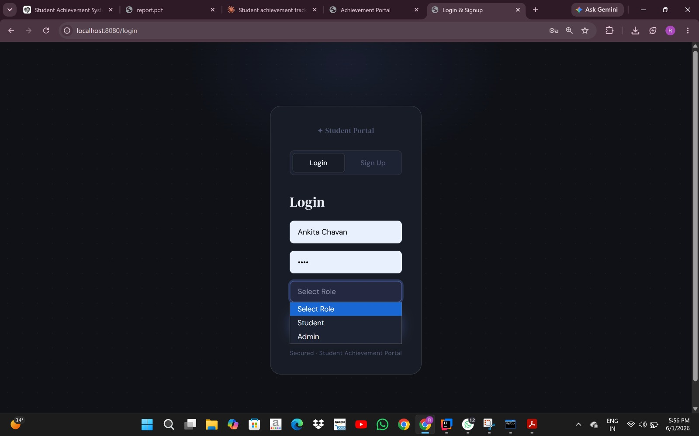
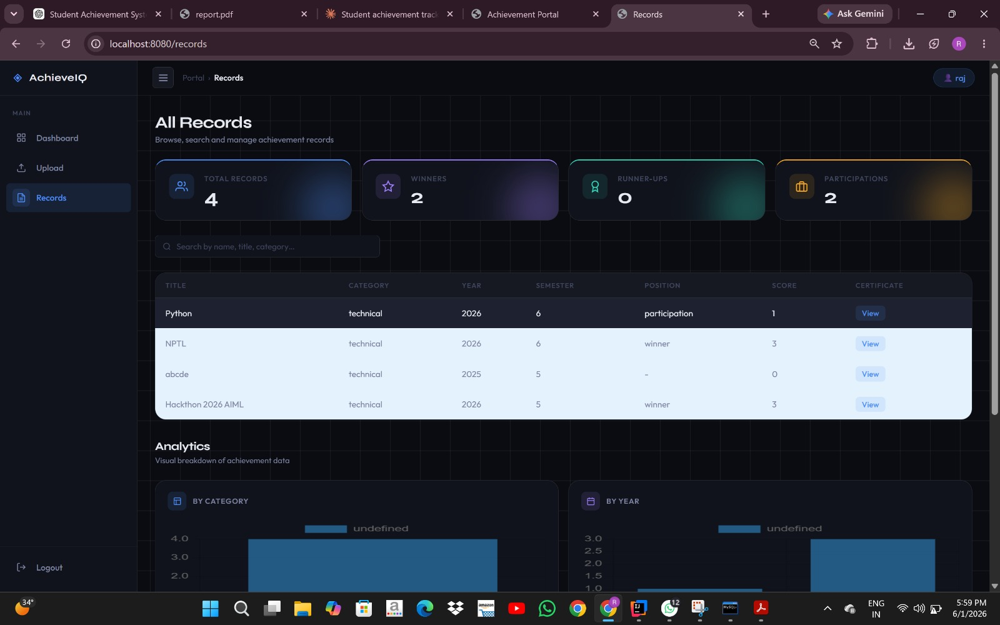

# 🎓 Student Achievement Management System

## 🚀 Overview

The Student Achievement Management System is a full-stack web application designed to manage and track student achievements efficiently across different semesters.

It provides a centralized platform where students can upload their achievements and administrators can monitor, verify, and generate reports.

---

## 🛠️ Tech Stack

* **Backend:** Java, Spring Boot
* **Frontend:** HTML, CSS, JavaScript
* **Database:** MySQL
* **Tools:** Git, GitHub, Postman

---

## ✨ Features

* 🔐 User Authentication (Admin & Student Login)
* 📊 Dashboard with analytics
* 📝 CRUD operations for achievements
* 📎 Certificate upload functionality
* 📄 PDF report generation
* 📊 Excel export support
* 🔍 Filtering and record management

---

## 🧠 Architecture (Project Structure)

* Controller Layer → Handles requests
* Service Layer → Business logic
* Repository Layer → Database operations
* Model Layer → Entity classes

---

## 🎯 My Contribution

* Developed backend using Spring Boot
* Designed REST APIs for data handling
* Created database schema in MySQL
* Integrated frontend with backend
* Implemented features like file upload and reporting

---
## 🗄️ Database Setup (MySQL)

This project uses MySQL as the database, configured via command line.

### Steps to setup database:

1. Install MySQL Server

2. Open MySQL Command Line Client

3. Create database:

   ```sql
   CREATE DATABASE achievement_db;
   ```

4. Update credentials in `application.properties`:

   ```properties
   spring.datasource.url=jdbc:mysql://localhost:3306/achievement_db
   spring.datasource.username=your_username
   spring.datasource.password=your_password
   ```

5. Run the Spring Boot application

The required tables will be created automatically using JPA.


## ▶️ How to Run the Project

1. Clone the repository
2. Open in IntelliJ / VS Code
3. Configure MySQL database in `application.properties`
4. Run the main class:
   `AchievementTrackingApplication.java`
5. Open browser:
   `http://localhost:8080`

---

## 📸 Screenshots

### Dashboard



### Login Page



### Records Page



---

## 🔮 Future Improvements

* Add JWT Authentication
* Improve UI using React
* Deploy on cloud (AWS / Azure)
* Add role-based access security

---

## 📌 Conclusion

This project demonstrates my ability to build a real-world full-stack application using Java and Spring Boot, with proper backend architecture and frontend integration.

---

## 👨‍💻 Author

Rohan Chavan
